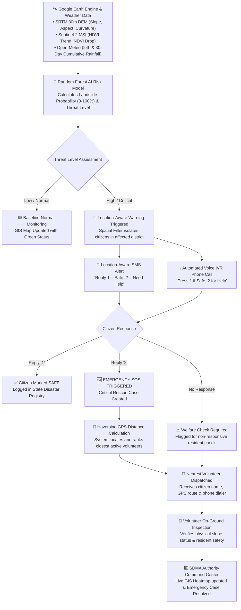

# SlopeSense AI — Main System Flowchart

Here is the complete visual flowchart showing how **SlopeSense AI** works from satellite telemetry ingestion all the way to citizen check-in and volunteer rescue dispatch.

---

---

### Step-by-Step Flow Explanation (For Your Pitch)

1. **Step 1: Environmental Telemetry**: Satellites and weather APIs continuously feed terrain slope, vegetation loss, and 30-day cumulative rainfall into the system.
2. **Step 2: AI Risk Prediction**: The Random Forest model computes a real-time landslide risk score and threat level (`LOW`, `MODERATE`, `HIGH`, `CRITICAL`).
3. **Step 3: Location-Filtered Alert**: If risk is High or Critical, the spatial filter targets *only* citizens registered in the affected district.
4. **Step 4: Dual-Channel Delivery**: SMS and automated voice phone calls are broadcast to residents' phones without requiring mobile internet.
5. **Step 5: Citizen Check-In**:
   - `1 = Safe`: Automatically marked safe in the government registry.
   - `2 = Need Help (SOS)`: Instantly creates a Critical Emergency Case.
   - `No Response`: Automatically added to the welfare check queue.
6. **Step 6: Proximity Volunteer Dispatch**: The Haversine GPS algorithm automatically assigns the closest verified local responder in the village (e.g. *1.4 km away*).
7. **Step 7: Ground Truth Verification & Resolution**: The volunteer confirms the site on the ground and resolves the case, synchronizing with the State Disaster Management Authority dashboard in real time.
