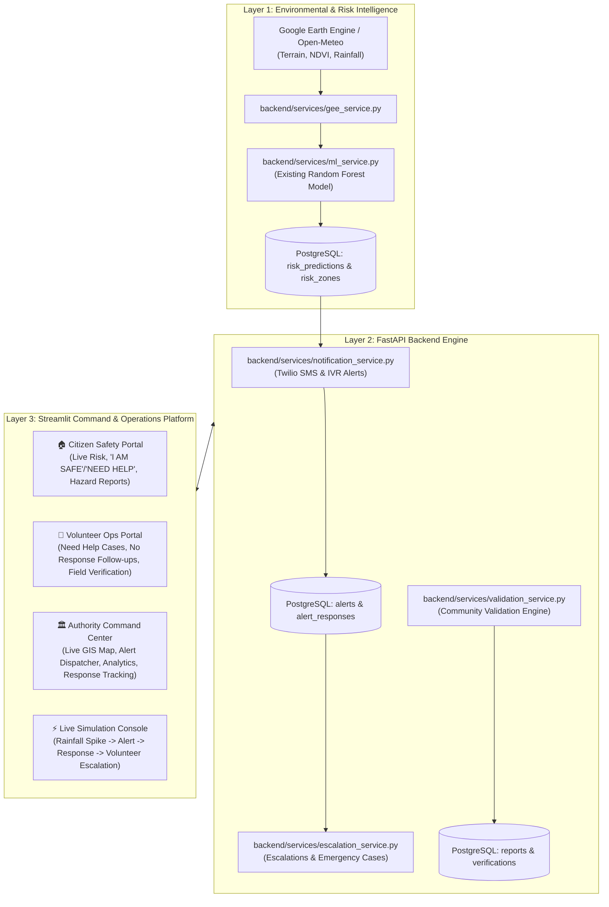

# Implementation Plan: SlopeSense AI - Disaster Intelligence & Response Platform

Build a production-ready disaster intelligence platform called **SlopeSense AI** designed for Northeast India, integrating Google Earth Engine (GEE), existing Random Forest ML risk models, GIS mapping, multi-channel SMS & IVR alerting, community hazard reporting, volunteer field verification, and an authority command center.

---

## User Review Required

> [!IMPORTANT]
> **ML Integration Contract Preserved**:
> - We strictly consume the existing Random Forest model (`models/rf_model.pkl` and `models/feature_cols.pkl`) with its exact 8-feature signature: `['slope', 'aspect', 'curvature', 'rainfall_mm', 'cumulative_rainfall_30d', 'ndvi_trend', 'ndvi_drop', 'distance_to_river']`.
> - No models will be retrained, replaced, or modified.
> - Frontend displays citizen-friendly explanations (Risk Levels, Score, Contributing Factors, Actionable Advisory) rather than raw scientific features.

> [!NOTE]
> **Twilio & GEE Dual-Mode Operation**:
> - Real Twilio API & Google Earth Engine credentials will be supported via `.env` configuration.
> - When credentials are not provided or during offline testing, the system operates seamlessly with a high-fidelity local simulation mode (realistic live Open-Meteo / cached environmental data and interactive SMS/IVR test consoles), ensuring 100% demo reliability for hackathon presentations.

---

## Architecture Overview



---

## Proposed Changes

### 1. Backend Core & Configuration

#### [NEW] [backend/core/config.py](file:///Users/dhruvpatil/Desktop/slopesense-ai/backend/core/config.py)
- Pydantic Settings management (`DATABASE_URL`, `JWT_SECRET`, `JWT_ALGORITHM`, `ACCESS_TOKEN_EXPIRE_MINUTES`, `TWILIO_ACCOUNT_SID`, `TWILIO_AUTH_TOKEN`, `TWILIO_PHONE_NUMBER`, `GEE_PROJECT`, `ENVIRONMENT`).
- Automatic fallback from PostgreSQL to SQLite for standalone local testing if PostgreSQL server is not running locally.

#### [NEW] [backend/core/database.py](file:///Users/dhruvpatil/Desktop/slopesense-ai/backend/core/database.py)
- SQLAlchemy declarative base, engine initialization with connection pooling, session dependency `get_db()`.

#### [NEW] [backend/core/security.py](file:///Users/dhruvpatil/Desktop/slopesense-ai/backend/core/security.py)
- Passlib bcrypt password hashing and verification.
- JWT token generation and validation.
- FastAPI dependencies: `get_current_user`, `require_roles(allowed_roles)`.

---

### 2. Database Models (SQLAlchemy with UUID PKs matching `DATABASE_SCHEMA.md`)

#### [NEW] [backend/models/user.py](file:///Users/dhruvpatil/Desktop/slopesense-ai/backend/models/user.py)
- `User`: `id` (UUID PK), `full_name`, `phone_number` (unique), `email` (unique), `password_hash`, `role` (`citizen`, `volunteer`, `authority`), `district`, `state`, `latitude`, `longitude`, `created_at`, `updated_at`.

#### [NEW] [backend/models/risk.py](file:///Users/dhruvpatil/Desktop/slopesense-ai/backend/models/risk.py)
- `RiskPrediction`: `id` (UUID PK), `location_name`, `latitude`, `longitude`, `risk_level`, `risk_score`, `confidence_score`, `rainfall`, `slope`, `ndvi`, `predicted_at`, `factors` (JSON).
- `RiskZone`: `id` (UUID PK), `prediction_id` (FK), `zone_name`, `district`, `state`, `geometry_data` (JSONB), `risk_level`, `created_at`.

#### [NEW] [backend/models/alert.py](file:///Users/dhruvpatil/Desktop/slopesense-ai/backend/models/alert.py)
- `Alert`: `id` (UUID PK), `prediction_id` (FK), `title`, `description`, `risk_level`, `status` (`PENDING`, `SENT`, `ACTIVE`, `EXPIRED`), `sent_at`, `expires_at`.
- `AlertRecipient`: `id` (UUID PK), `alert_id` (FK), `user_id` (FK), `delivery_method` (`SMS`, `IVR`, `APP`), `delivered_at`, `delivery_status` (`SENT`, `FAILED`, `DELIVERED`).
- `AlertResponse`: `id` (UUID PK), `alert_id` (FK), `user_id` (FK), `response_type` (`SAFE`, `NEED_HELP`, `NO_RESPONSE`), `responded_at`.

#### [NEW] [backend/models/report.py](file:///Users/dhruvpatil/Desktop/slopesense-ai/backend/models/report.py)
- `Report`: `id` (UUID PK), `user_id` (FK), `alert_id` (FK nullable), `observation_type` (`ROAD_CRACK`, `FALLING_ROCKS`, `SOIL_MOVEMENT`, `ROAD_BLOCKAGE`, `WATER_FLOW_CHANGE`), `description`, `image_url`, `latitude`, `longitude`, `status` (`PENDING`, `COMMUNITY_CONFIRMED`, `VOLUNTEER_VERIFIED`, `REJECTED`), `created_at`.
- `VolunteerAssignment`: `id` (UUID PK), `volunteer_id` (FK), `alert_id` (FK nullable), `report_id` (FK nullable), `assigned_by` (FK), `priority` (`LOW`, `MEDIUM`, `HIGH`, `CRITICAL`), `status` (`ASSIGNED`, `IN_PROGRESS`, `RESOLVED`, `CLOSED`), `assigned_at`.
- `VerificationReport`: `id` (UUID PK), `assignment_id` (FK), `volunteer_id` (FK), `findings`, `evidence_url`, `verification_status` (`CONFIRMED`, `PARTIALLY_CONFIRMED`, `FALSE_ALARM`), `verified_at`.
- `EmergencyCase`: `id` (UUID PK), `alert_response_id` (FK nullable), `citizen_id` (FK), `case_type` (`NEED_HELP`, `NO_RESPONSE`), `priority`, `status` (`OPEN`, `ASSIGNED`, `IN_PROGRESS`, `RESOLVED`), `created_at`.

#### [NEW] [backend/models/system.py](file:///Users/dhruvpatil/Desktop/slopesense-ai/backend/models/system.py)
- `Notification`: `id` (UUID PK), `user_id` (FK), `title`, `message`, `type` (`ALERT`, `REPORT`, `ASSIGNMENT`, `SYSTEM`), `is_read`, `created_at`.
- `AuditLog`: `id` (UUID PK), `user_id` (FK nullable), `action`, `entity_type`, `entity_id`, `created_at`.

---

### 3. Pydantic Schemas

#### [NEW] [backend/schemas/auth.py](file:///Users/dhruvpatil/Desktop/slopesense-ai/backend/schemas/auth.py)
- `UserRegisterRequest`, `UserLoginRequest`, `TokenResponse`, `UserResponse`.

#### [NEW] [backend/schemas/risk.py](file:///Users/dhruvpatil/Desktop/slopesense-ai/backend/schemas/risk.py)
- `RiskPredictionRequest`, `MLPredictRequest`, `RiskPredictionResponse`, `RiskMapItem`, `RiskLatestResponse`.

#### [NEW] [backend/schemas/alert.py](file:///Users/dhruvpatil/Desktop/slopesense-ai/backend/schemas/alert.py)
- `AlertCreateRequest`, `AlertResponse`, `AlertDetailResponse`, `CitizenAlertResponseCreate`, `CitizenAlertResponseItem`.

#### [NEW] [backend/schemas/report.py](file:///Users/dhruvpatil/Desktop/slopesense-ai/backend/schemas/report.py)
- `ReportCreateRequest`, `ReportResponse`, `EvidenceUploadResponse`.

#### [NEW] [backend/schemas/volunteer.py](file:///Users/dhruvpatil/Desktop/slopesense-ai/backend/schemas/volunteer.py)
- `VolunteerCaseItem`, `VolunteerVerifyRequest`, `VerificationReportResponse`, `CaseStatusUpdateRequest`.

#### [NEW] [backend/schemas/authority.py](file:///Users/dhruvpatil/Desktop/slopesense-ai/backend/schemas/authority.py)
- `AuthorityDashboardSummary`, `CommunityStatusSummary`, `VolunteerActivitySummary`, `SendAlertRequest`, `DistrictRiskAnalytics`.

---

### 4. Core Services

#### [NEW] [backend/services/ml_service.py](file:///Users/dhruvpatil/Desktop/slopesense-ai/backend/services/ml_service.py)
- Loads `models/rf_model.pkl` and `models/feature_cols.pkl`.
- Predicts probability, outputs normalized Risk Score (0-100), Risk Level (`LOW` <40, `MODERATE` 40-74, `HIGH` 75-89, `CRITICAL` >=90), Confidence Score (85-98%).
- Generates human-friendly explanations and safety action advice (e.g. "Heavy rainfall (110 mm)", "Steep terrain (45°)", "Rapid NDVI drop").
- Persists predictions to PostgreSQL.

#### [NEW] [backend/services/gee_service.py](file:///Users/dhruvpatil/Desktop/slopesense-ai/backend/services/gee_service.py)
- Interacts with Google Earth Engine / Open-Meteo for rainfall, NDVI, terrain slope/aspect/curvature.
- Provides cached baseline monitoring points for Northeast India (Dima Hasao, Haflong, Shillong, Cherrapunji, Kohima, Aizawl, Itanagar).
- Seamless fallback when in sandbox/offline environments.

#### [NEW] [backend/services/notification_service.py](file:///Users/dhruvpatil/Desktop/slopesense-ai/backend/services/notification_service.py)
- Twilio SMS and Voice/IVR integration for emergency broadcasts.
- TwiML generator for interactive voice response ("Press 1 if you are safe, Press 2 if you need emergency assistance").
- Webhook parsers for incoming SMS replies and DTMF keypad tones.
- Simulation dispatcher for interactive test demonstrations.

#### [NEW] [backend/services/validation_service.py](file:///Users/dhruvpatil/Desktop/slopesense-ai/backend/services/validation_service.py)
- Multi-tier Community Validation Engine:
  - 1 Report: `PENDING`
  - 3 Similar Reports within 2km and 6h: Auto-promoted to `COMMUNITY_CONFIRMED`
  - Field verification by a volunteer: Promoted to `VOLUNTEER_VERIFIED`

#### [NEW] [backend/services/escalation_service.py](file:///Users/dhruvpatil/Desktop/slopesense-ai/backend/services/escalation_service.py)
- Implements the Critical Response Workflow:
  - Citizen responds `NEED_HELP` -> Creates High Priority `EmergencyCase`, assigns/alerts available volunteers, notifies authority.
  - Citizen gives `NO_RESPONSE` -> Creates Medium/High Priority `EmergencyCase` for welfare verification.
  - Handles status transitions (`OPEN` -> `ASSIGNED` -> `IN_PROGRESS` -> `RESOLVED` -> `CLOSED`).

---

### 5. API Endpoints (FastAPI)

#### [NEW] [backend/api/v1/auth.py](file:///Users/dhruvpatil/Desktop/slopesense-ai/backend/api/v1/auth.py)
- `POST /auth/register`
- `POST /auth/login`
- `GET /auth/me`

#### [NEW] [backend/api/v1/risk.py](file:///Users/dhruvpatil/Desktop/slopesense-ai/backend/api/v1/risk.py)
- `GET /risk/latest`
- `GET /risk/map`
- `POST /risk/predict`
- `POST /ml/predict` (compatible with `docs/API_SPEC.md`)

#### [NEW] [backend/api/v1/alerts.py](file:///Users/dhruvpatil/Desktop/slopesense-ai/backend/api/v1/alerts.py)
- `POST /alerts`
- `GET /alerts`
- `GET /alerts/{id}`
- `POST /alerts/respond`
- `GET /alerts/responses/me`
- `POST /alerts/webhook/twilio-sms`
- `POST /alerts/webhook/twilio-voice`

#### [NEW] [backend/api/v1/reports.py](file:///Users/dhruvpatil/Desktop/slopesense-ai/backend/api/v1/reports.py)
- `POST /reports`
- `POST /reports/upload`
- `GET /reports`
- `GET /reports/{id}`

#### [NEW] [backend/api/v1/volunteer.py](file:///Users/dhruvpatil/Desktop/slopesense-ai/backend/api/v1/volunteer.py)
- `GET /volunteer/cases`
- `GET /volunteer/need-help`
- `GET /volunteer/no-response`
- `POST /volunteer/verify`
- `POST /volunteer/evidence`
- `PATCH /volunteer/cases/{id}/status`

#### [NEW] [backend/api/v1/authority.py](file:///Users/dhruvpatil/Desktop/slopesense-ai/backend/api/v1/authority.py)
- `GET /authority/dashboard`
- `GET /authority/community-status`
- `GET /authority/volunteers`
- `POST /authority/send-alert`
- `GET /authority/analytics`

#### [NEW] [backend/api/v1/notifications.py](file:///Users/dhruvpatil/Desktop/slopesense-ai/backend/api/v1/notifications.py)
- `GET /notifications`
- `PATCH /notifications/{id}/read`

#### [NEW] [backend/main.py](file:///Users/dhruvpatil/Desktop/slopesense-ai/backend/main.py)
- FastAPI application entrypoint, CORS configuration, API router registration under `/api/v1` and compatibility redirects, `/health` endpoint, static file serving for uploaded photos.

#### [NEW] [backend/seed_data.py](file:///Users/dhruvpatil/Desktop/slopesense-ai/backend/seed_data.py)
- Seeds initial data: default users for all 3 roles, real Northeast India risk points, active alerts, sample emergency cases, and community reports.

---

### 6. Frontend Platform (Streamlit + Folium + Plotly)

#### [MODIFY] [app.py](file:///Users/dhruvpatil/Desktop/slopesense-ai/app.py)
Transform into the full-scale government-grade disaster intelligence platform:
- **Design System**: Rich custom CSS styling (dark command center `#0b132b`, `#1c2541`, glowing neon status markers, KPI metric tiles, glassmorphism cards).
- **Navigation & Role Switching**:
  - Live Emergency Banner & System Clock
  - Role switcher tabs / Authenticated session bar:
    1. 🏠 **Citizen Safety Portal**
    2. 👷 **Volunteer Operations Portal**
    3. 🏛️ **Authority Command Center**
    4. ⚡ **Live Disaster Simulation Console**
- **Citizen Experience**:
  - High-urgency Landslide Risk Gauge & Human-friendly Safety Advisory
  - Interactive GIS Risk & Shelter Map
  - 1-Click Safety Check-In (`I AM SAFE` / `NEED HELP`)
  - Ground Hazard Reporting form (Road crack, falling rocks, soil movement, road blockage, water flow change) with photo upload & GPS coordinates
  - Helpline Quick-Dials & Safe Evacuation Guides
- **Volunteer Experience**:
  - Operations Dashboard with KPI cards (Assigned, In Progress, Resolved)
  - Prioritized Case Queues (`NEED_HELP`, `NO_RESPONSE`)
  - Direct Citizen Contact & Field Visit Dispatch
  - Ground Verification Form (Findings, photo evidence upload, GPS location, verification status)
  - Volunteer Verification History
- **Authority Command Center**:
  - Executive Overview KPI Matrix (Active Alerts, Safe Citizens, Need Help, No Response, Active Responders, High-Risk Districts)
  - Live Multi-layer GIS Command Map (Folium with Risk Zones, Citizen Incidents, Volunteer Tracking, Evacuation Shelters)
  - Targeted Multi-Channel Alert Dispatcher (District targeting, SMS & Voice IVR broadcast trigger)
  - Citizen Safety Status & Response Breakdown (Plotly Donut & Bar charts)
  - Volunteer Force Operations & Emergency Case Resolver
  - GEE & ML Intelligence Studio (Rainfall vs Risk trends, terrain slope analysis, what-if scenario testing)
- **Live Disaster Simulation Console**:
  - Step-by-step interactive demonstration panel for Smart India Hackathon jury:
    - Step 1: Simulate heavy monsoon cloudburst in Dima Hasao / Shillong
    - Step 2: ML Engine calculates CRITICAL Risk (Score 92%)
    - Step 3: Authority broadcasts multi-channel SMS & IVR warnings
    - Step 4: Simulate citizen responses (Safe, Need Help, No Response)
    - Step 5: Automated Volunteer Escalation & Dispatch
    - Step 6: Volunteer field verification & Authority resolution

---

## Verification Plan

### Automated Tests
1. **Backend Unit & Integration Tests**:
   - Create `tests/test_api.py` covering:
     - Authentication (`/auth/register`, `/auth/login`, JWT validation, role checks)
     - ML Service prediction (`/ml/predict`, `/risk/predict`, `/risk/latest`, `/risk/map`)
     - Alert Generation & Citizen Response (`/alerts`, `/alerts/respond`, `/alerts/responses/me`)
     - Community Hazard Reports (`/reports`, validation progression)
     - Volunteer Operations (`/volunteer/cases`, `/volunteer/verify`)
     - Authority Dashboard & Community Status (`/authority/dashboard`, `/authority/community-status`)
     - Twilio SMS / Voice Webhook callbacks
2. **Execute Tests**:
   ```bash
   source .venv/bin/activate && pytest tests/ -v
   ```

### Manual Verification
1. Start FastAPI backend:
   ```bash
   source .venv/bin/activate && uvicorn backend.main:app --port 8000
   ```
2. Start Streamlit frontend:
   ```bash
   source .venv/bin/activate && streamlit run app.py --server.port 8501
   ```
3. Test end-to-end user workflows:
   - Login as Citizen -> submit "NEED HELP" -> verify emergency case created.
   - Login as Volunteer -> see assigned "NEED HELP" case -> upload verification evidence -> confirm incident.
   - Login as Authority -> view command center map, see real-time status update, trigger new SMS/IVR alert.
   - Run the Live Simulation Console to execute the full 6-step disaster response lifecycle.
